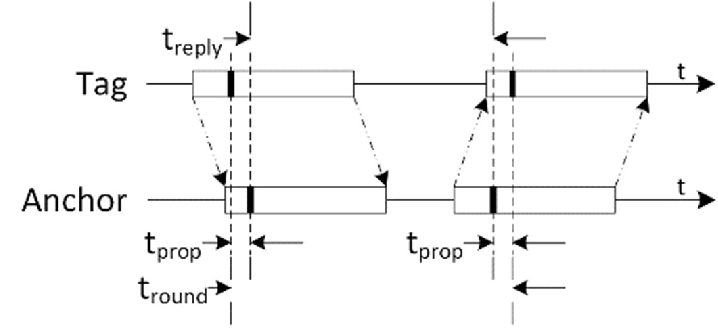
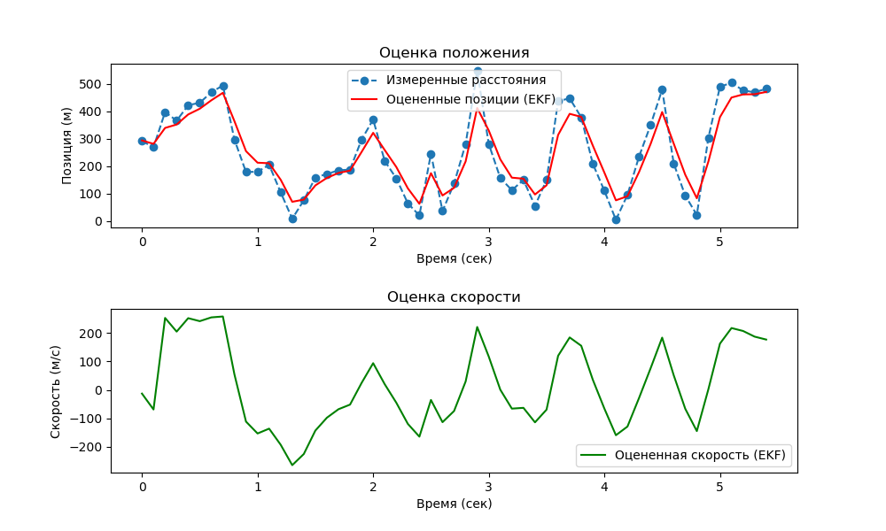
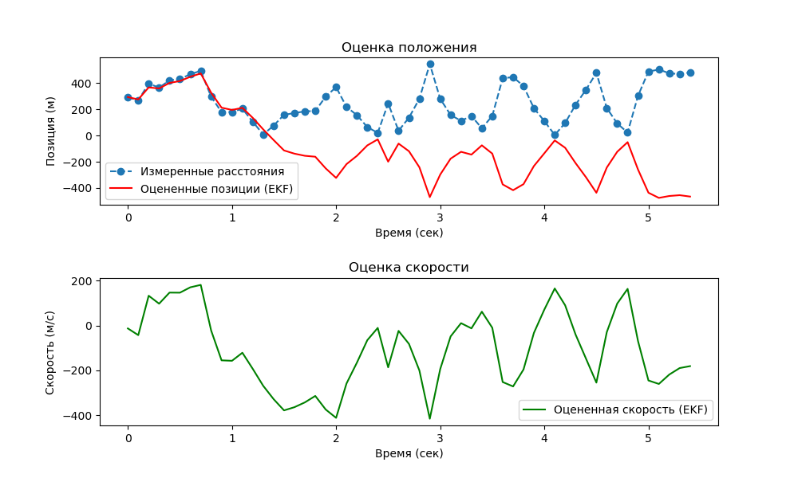
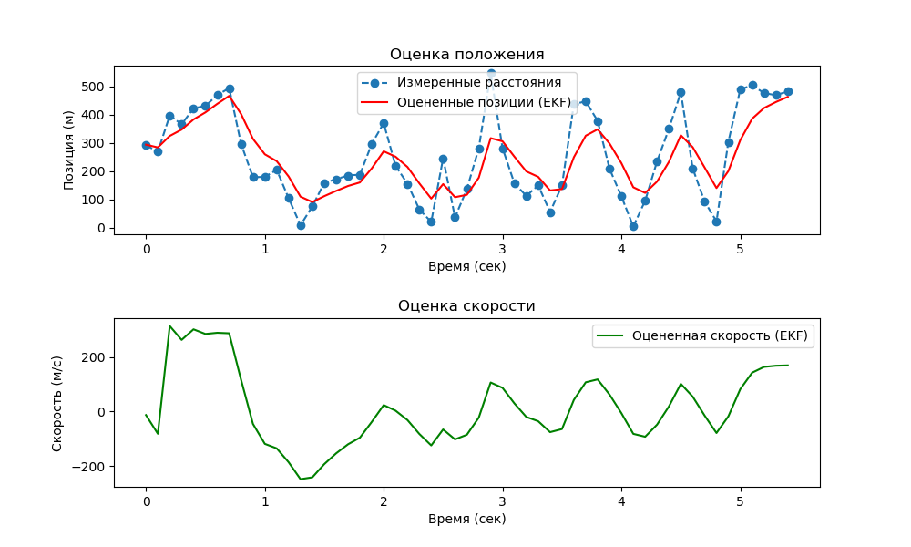

# Лабораторная работа: Измерение расстояний между UWB-трекерами и фильтрация данных

## Описание

В данной лабораторной работе мы исследуем принципы измерения расстояния между двумя UWB (Ultra-Wideband) трекерами: **tag** и **anchor**, а также применяем одномерный расширенный фильтр Калмана (EKF) для фильтрации измеренных данных и восстановления более точных координат и скоростей.
Все скрипты, на которые мы ссылаемся в лабораторной работе можно найти по [ссылке](https://github.com/NatalyaSklyar/UBW_LAB1/blob/main/README.md).

## О UWB-трекерах

UWB-трекеры — это устройства, способные точно измерять расстояние друг до друга с помощью импульсных радиосигналов.


* **Anchor** — это стационарное устройство, к которому привязываются измерения. Оно инициирует опрос, отправляя сигнал tag'у, и по времени ответа оценивает расстояние.
* **Tag** — это подвижное устройство, которое принимает сигнал от anchor'а и отвечает на него. На основе времени между отправкой и приёмом сигнала, anchor рассчитывает расстояние до tag.


Измерения происходят с использованием протокола Time-of-Flight (ToF), обеспечивающего точность на уровне нескольких сантиметров. Каждое измерение представляет собой задержку между отправкой сигнала и его приёмом с учётом времени на обработку. Эта информация преобразуется в расстояние с учётом скорости радиосигнала (практически равной скорости света).




---

## Оборудование и програмное обеспечение

Мы используем UWB-трекеры QORVO DWM1000 UWB.


На устройства уже загружено програмное обеспечение на основе mpremote. 
На комьютере должен быть установлен python3, [mpremote](https://docs.micropython.org/en/latest/reference/mpremote.html).
Так же будут необходимы пакеты [numpy](https://numpy.org/install/), [matplotlib](https://matplotlib.org/stable/install/index.html) и [jsonlib](https://pypi.org/project/jsonlib/)

Код программного обеспечения можно найти по [ссылке](https://github.com/soccos-uwb/micropython/tree/dev/examples/UWB/Lab%20DS-TWR).

---


## Подключение оборудования

1. Подключаем два UWB трекера к компьютеру по USB. На них уже загружены прошивки.
2. Проверяем список подключенных устройств:

   ```bash
   ls /dev/tty.usbmodem*
   ```

   Вы увидите, например:

   ```
   /dev/tty.usbmodem0007601893361
   /dev/tty.usbmodem0007601888971
   ```
3. Запускаем скрипт `tag.py` на одном из устройств:

   ```bash
   mpremote connect /dev/tty.usbmodem0007601893361 run tag.py
   ```
4. Запускаем скрипт `anchor.py` на другом устройстве, при этом сохраняем вывод в лог-файл:

   ```bash
   mpremote connect /dev/tty.usbmodem0007601888971 run anchor.py > data/log.txt
   ```
5. Имитируем движение tag по произвольной траектории — anchor будет записывать измерения расстояний между устройствами в `data/log.txt` (можно указать другое).

---

## Предобработка данных

Консольные логи из `log.txt` необходимо преобразовать в структурированный формат (JSON или список словарей) для дальнейшей обработки. 
Для этого применяем к ним регулярное выражение, программа реализована во вспомогательном файле src/convert_logs.py

```bash
python3 src/convert_logs.py <путь_к_входному_txt_файлу> <путь_к_выходному_json_файлу>
```

Результатом будет файл с измерениями, который может быть передан на вход фильтрации.


---

## Оценка точности измерений

Перед запуском фильтра полезно провести серию статических измерений — расположить устройства на фиксированном расстоянии и записать несколько десятков измерений. Это позволяет:
	•	Оценить статистическую погрешность измерений;
	•	Вычислить дисперсию измерений, которую можно использовать в качестве параметра R фильтра Калмана.

Формула оценки дисперсии:

$$
\sigma^2 = \frac{1}{N} \sum_{i=1}^N (x_i - \bar{x})^2
$$

где $x_i$ — отдельное измерение, $\bar{x}$ — среднее значение, $N$ — число измерений.

Скрипт для оценки дисперсии:

```bash
python3 src/estimate_variance.py <полный_путь_к_файлу>
```

Он выведет ключевые статистические параметры измерений.

⚠️ Для корректной работы необходимо предварительно сконвертировать данные из логов в json-файл.

## Фильтрация данных

Фильтрация производится с использованием одномерного расширенного фильтра Калмана (EKF), который восстанавливает положение и скорость tag по шумным измерениям расстояний.

### Как работает фильтр?

Фильтр Калмана — это рекурсивный алгоритм, который на каждом шаге:

1.	Предсказывает новое состояние системы на основе модели движения;

2.  Oбновляет это состояние на основе новых измерений.

В нашем случае фильтр восстанавливает вектор состояния:

$$
\mathbf{x}_t = \begin{bmatrix} x_t \ v_t \end{bmatrix}
$$

где $x_t$ — координата вдоль оси, $v_t$ — скорость движения tag.

Модель перехода (предсказание):

$$
\mathbf{x}{t|t-1} = \begin{bmatrix} 1 & \Delta t \ 0 & 1 \end{bmatrix} \mathbf{x}{t-1}
$$

$$
\mathbf{P}{t|t-1} = \mathbf{F} \mathbf{P}{t-1} \mathbf{F}^\top + \mathbf{Q}
$$

где $\mathbf{F}$ — матрица перехода, $\mathbf{P}$ — ковариационная матрица ошибки, $\mathbf{Q}$ — ковариация движения.

Модель измерений:

Измеряемое расстояние $z_t$ нелинейно зависит от координаты:

$$
z_t = h(\mathbf{x}_t) = \sqrt{(x_t - x_a)^2}
$$

Чтобы применить EKF, используется линейное приближение — Якобиан:

$$
\mathbf{H}_t = \frac{\partial h}{\partial \mathbf{x}} = \begin{bmatrix} \frac{x_t - x_a}{\sqrt{(x_t - x_a)^2}} & 0 \end{bmatrix}
$$

Коррекция (обновление по измерению):

$$
\mathbf{K}t = \mathbf{P}{t|t-1} \mathbf{H}_t^\top \left( \mathbf{H}t \mathbf{P}{t|t-1} \mathbf{H}_t^\top + \mathbf{R} \right)^{-1}
$$

$$
\mathbf{x}t = \mathbf{x}{t|t-1} + \mathbf{K}t \left( z_t - h(\mathbf{x}{t|t-1}) \right)
$$

$$
\mathbf{P}_t = (\mathbf{I} - \mathbf{K}_t \mathbf{H}t) \mathbf{P}{t|t-1}
$$


Фильтр Калмана — это рекурсивный алгоритм, который обновляет оценки состояния системы (в нашем случае — координаты и скорости tag) на основе модели движения и входящих измерений.

Расширенный фильтр Калмана учитывает нелинейную зависимость между расстоянием и положением, аппроксимируя её с помощью якобианов.

На каждом шаге фильтр выполняет:

1. **Прогноз** нового состояния на основе предыдущей скорости и положения
2. **Коррекцию** на основе нового измерения расстояния

Таким образом, он эффективно сглаживает шум и восстанавливает траекторию движения.

### Запуск фильтра:

```bash
python3 src/EKF_1D/main.py <путь_к_входному_json_файлу> <путь_к_выходному_json_файлу> <путь_к_png_графику> 
```

При запуске необходимо ввести:

* **Дисперсию измерений** — вычисляется по статическим данным;
* **Дисперсию движения** — отражает изменчивость движения tag;
* **Начальное расстояние** между tag и anchor;
* **Статистическая погрешность** — значение вычисленное при измерении с неподвижными датчиками.


### Как проверить корректность параметров R и Q

Значения R и Q можно оценить на основе экспериментальных данных:

🔹 Проверка R (дисперсии измерений)
1.	Вычислить отклонения измерений от предсказаний:

$$
r_t = z_t - h(\mathbf{x}_{t|t-1})
$$

2.	Найти их дисперсию:

$$
\hat{R} = \text{Var}(r_t)
$$

3.	Сравнить с заданной R. Если $\hat{R} \approx R$, модель согласована с измерениями.

🔹 Проверка Q (дисперсии движения)
1.	Из отфильтрованных данных получить приращения скорости:

$$
\Delta v_t = v_{t+1} - v_t
$$

2.	Найти их дисперсию:

$$
\hat{Q} = \text{Var}(\Delta v_t)
$$

3.	Сравнить с заданной Q. Если значения близки — параметры адекватны.

Хотя такие оценки не дают точных значений R и Q, они позволяют убедиться, что параметры фильтра согласованы с поведением системы.

---

## Интерпретация результатов

После работы фильтра вы получите график с:

* Измеренными расстояниями (с шумами)
* Отфильтрованными координатами и скоростью tag

Анализируя графики, можно:

* Оценить точность измерений
* Визуализировать реальную траекторию движения tag
* Понять, как параметры фильтра влияют на результат


1. Верно подобранная R
   

2. Поведение при слишком маленькой R
   

3. Поведение при завышенной R
   

